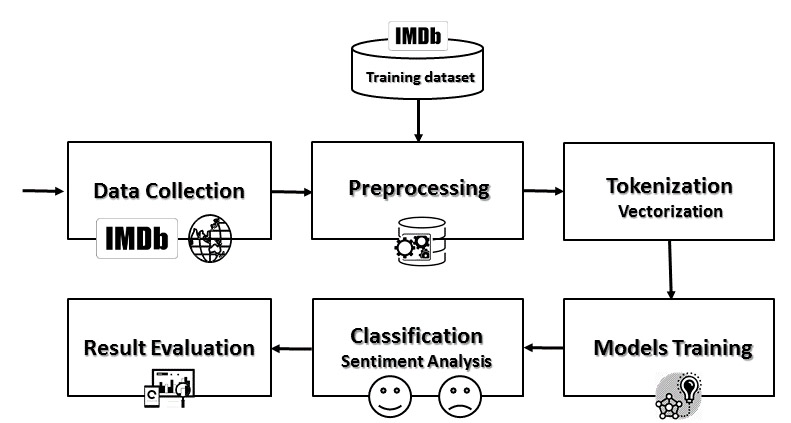
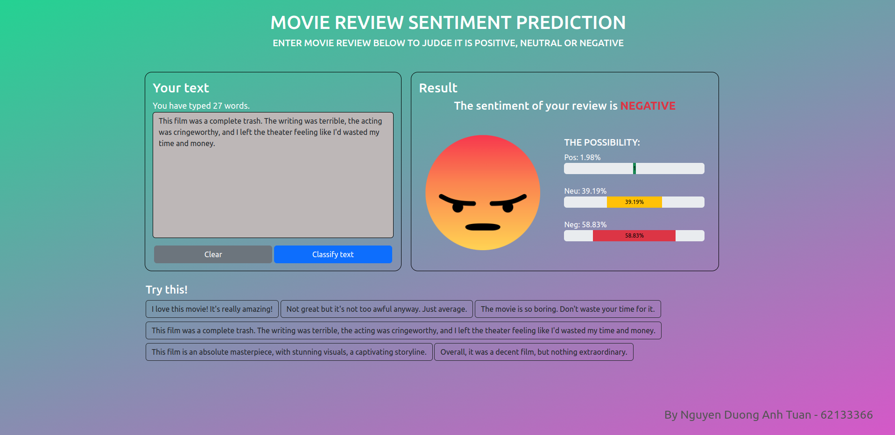

# Movie Reviews Sentiment Analysis

## Description

An application for sentiment analysis of movie comments, categorizing them as positive, negative, or neutral, employing deep learning models RNN and LSTM, utilizing the PyTorch framework for model creation and training, and deployed on the Django web framework.


## Get Started

The training data for the model consists of user comments collected from the top 100 popular movies on [IMDB](https://www.imdb.com). The method of data collection from movies listed on IMDB is described in [data_collecting.py](data/data_collecting.py), with the URLs provided in the file [urls.txt](data/urls.txt). After the data collection process, the data is compiled into two dataset files: [train.tsv](data/reviews.tsv) and [test.tsv](data/test.tsv), with detailed labels.
 * 0 (negative): The comments are rated on a scale from 1 to 4.
 * 1 (neutral): The comments are rated on a scale from 5 to 7.
 * 2 (positive): The comments are rated on a scale from 8 to 10.

The data in the file [train.tsv](data/reviews.tsv) is used for training the RNN model, while the data in the file [test.tsv](data/test.tsv) is used to evaluate the accuracy of the model.

The project utilizes the PyTorch library for model creation and training. To install PyTorch, please refer to the detailed instructions on the [PyTorch website](https://pytorch.org/get-started/locally).


## Requirements

### Pytorch installation

To install PyTorch, please refer to the detailed instructions on the [PyTorch website](https://pytorch.org/get-started/locally).

### Python version
 * 3.9 <= Python <= 3.11


## Installation

Clone repo:

```
git clone https://github.com/tuannguyen8531/Movie-Reviews-Sentiment-Analysis.git
```
    
Initialize and activate a virtual environment (if needed):

```
cd Movie-Reviews-Sentiment-Analysis
python -m venv venv
```
* Windows
```
venv/Scripts/activate
```
* Linux
```
source venv/bin/Activate.ps1 
```

Install dependencies

```
pip install -r requirements.txt
```

Install spacy english data:

```
python -m spacy download en_core_web_sm
```

Run project:

```
python manage.py runserver
```


## Notebook

The notebook [sentiment-analysis.ipynb](sentiment-analysis.ipynb) describes in detail the steps to create a model for sentiment analysis of movie comments as positive, negative, or neutral:

* Data preprocessing
* Data vectorization
* LSTM model creation and training
* Review classification
* Result evaluation




## Screenshots




## References

* <https://pytorch.org/docs/stable/index.html>
* <https://pytorch.org/tutorials/intermediate/char_rnn_classification_tutorial.html>
* <https://www.analyticsvidhya.com/blog/2021/07/understanding-rnn-step-by-step-with-pytorch/>
* <https://www.kaggle.com/competitions/sentiment-analysis-on-movie-reviews/>
* <https://www.kaggle.com/competitions/sentiment-analysis-on-imdb-movie-reviews>
* <https://www.analyticsvidhya.com/blog/2022/01/sentiment-analysis-with-lstm/>
* <https://www.embedded-robotics.com/sentiment-analysis-using-lstm/>
* <https://github.com/rasbt/stat453-deep-learning-ss21/blob/main/L15/2_packed-lstm.ipynb>
