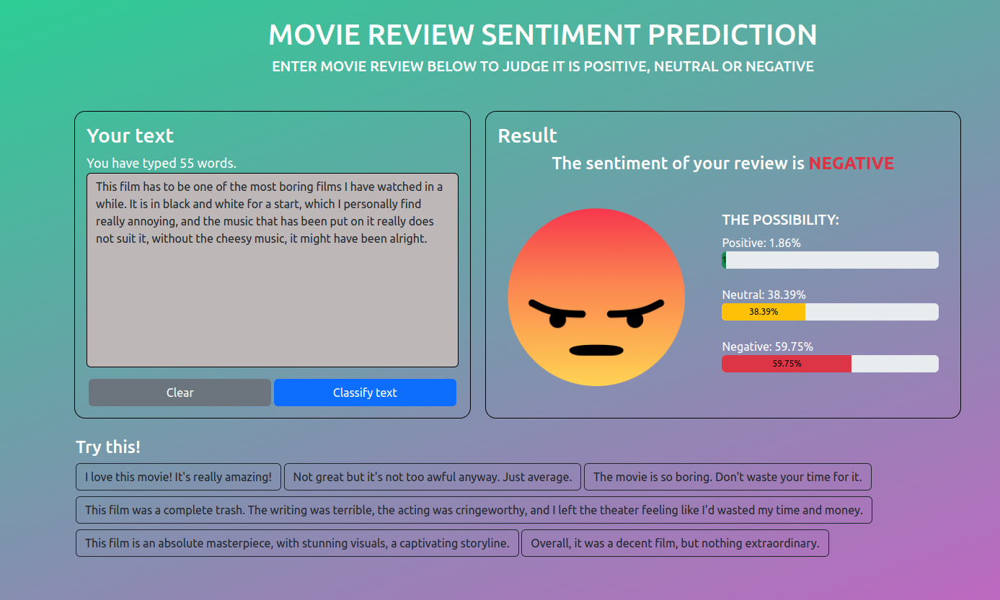

# Movie Reviews Sentiment Analysis

## Description

Ứng dụng phân tích cảm xúc bình luận phim dựa trên các mô hình deep learning RNN và LSTM, sử dụng framework Pytorch để tạo và huấn luyện mô hình bằng tập dữ liệu IMDB Dataset 50k Reviews, và được triển khai trên web framework Django.


## Get Started

Mô hình được huấn luyện dựa trên tập dữ liệu 50,000 bình luận phim của IMDB ([IMDB Dataset](https://www.kaggle.com/datasets/lakshmi25npathi/imdb-dataset-of-50k-movie-reviews)).

Dự án sử dụng thư viện Pytorch để tạo và huấn luyện mô hình. Để cài đặt Pytorch, xem hướng dẫn chi tiết trên [PyTorch website](https://pytorch.org/get-started/locally).
## Requirements

### Cài đặt Pytorch

Xem chi tiết các cài đặt trên [PyTorch website](https://pytorch.org/get-started/locally).

### Phiên bản Python
 * Python >= 3.9
## Installation

Clone repo:

```
git clone https://github.com/tuannguyen8531/Movie-Reviews-Sentiment-Analysis.git
```
    
Khởi tạo và kích hoạt môi trường ảo (nếu cần):

```
cd Movie-Reviews-Sentiment-Analysis
python -m venv venv
```
```
venv\Scripts\Activate.ps1 
```

Cài đặt các dependency:

```
pip install -r requirements.txt
```

Cài đặt spacy english data:

```
python -m spacy download en_core_web_sm
```

Chạy project:

```
python manage.py runserver
```
## Screenshots




## References

* <https://pytorch.org/docs/stable/index.html>
* <https://pytorch.org/tutorials/intermediate/char_rnn_classification_tutorial.html>
* <https://www.analyticsvidhya.com/blog/2021/07/understanding-rnn-step-by-step-with-pytorch/>
* <https://www.kaggle.com/competitions/sentiment-analysis-on-movie-reviews/>
* <https://www.kaggle.com/competitions/sentiment-analysis-on-imdb-movie-reviews>